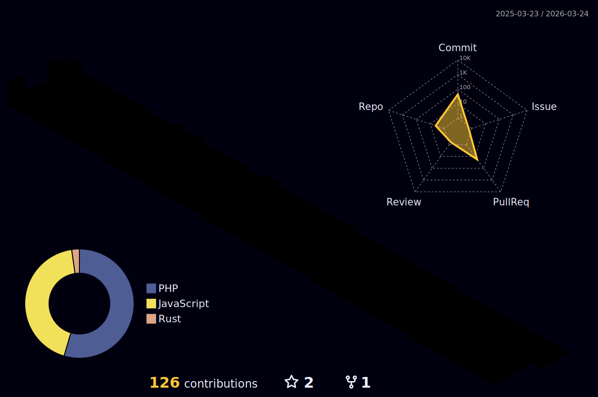

<table style="border-color: transparent;" cellspacing=0 >
  <tr>
    <td valign="center" width="60%">
      
### About Me
💡 &nbsp;Me encanta desarrollar software y aprender cosas nuevas.\
🌱 &nbsp;Actualmente aprendiendo **Rust** 🦀.\
✨ &nbsp;Actualmente aprendiendo ssi (self sovereign identity) y computer science.\
✉️ &nbsp;Sientete libre de contactarme en **limbertlino@gmail.com**.\
🤝 &nbsp;Sientete libre de añadirme a tus contactos en [Linkedin](https://www.linkedin.com/in/linomattos/).

</td>
<td valign="middle" width="40%">

  

</td>
</tr></table>

<table style="border-color: transparent;" cellspacing=0 ><tr><td valign="top" width="10%">

## Activity

 

&nbsp;

</td>
<td valign="top" width="33%">

 

</td></tr></table>

<table><tr><td valign="top" width="33%">
  
### Titulo 1

</td><td valign="top" width="33%">

### Titulo 2

</td>
<td valign="top" width="33%">

### Titulo 3

</td></tr></table>

