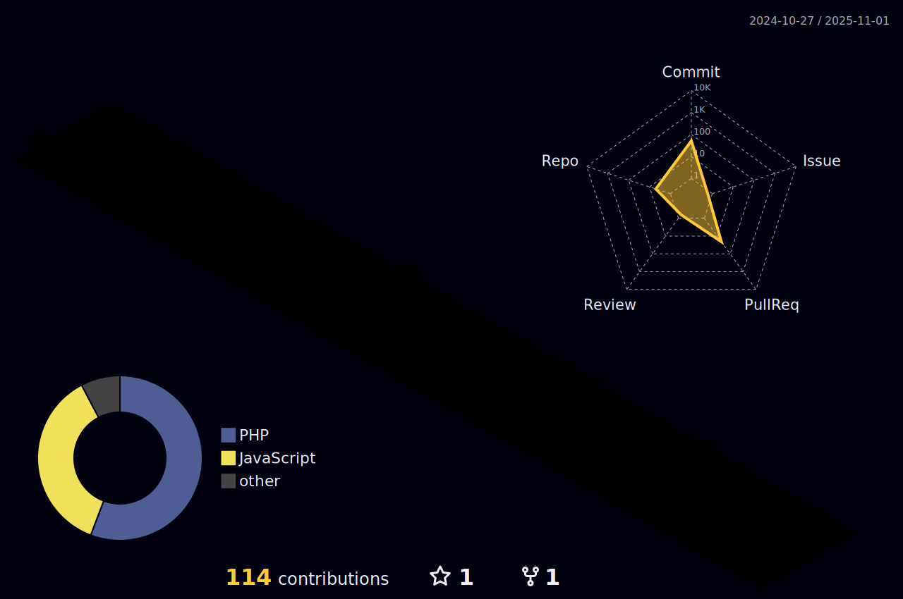

<table style="border-color: transparent;" cellspacing=0 >
  <tr>
    <td valign="center" width="60%">
      
### Sobre mí
💡 &nbsp;Me encanta desarrollar software y aprender cosas nuevas.\
🌱 &nbsp;Actualmente aprendiendo **Rust** 🦀.\
✨ &nbsp;Actualmente aprendiendo ssi (self sovereign identity) y computer science.\
✉️ &nbsp;Sientete libre de contactarme en **limbertlino@gmail.com**.\
🤝 &nbsp;Sientete libre de añadirme a tus contactos en [Linkedin](https://www.linkedin.com/in/linomattos/).

</td>
<td valign="middle" width="40%">

  

</td>
</tr></table>

<table>
  <tr>

<td valign="top" width="33%">

### Tecnologías

     
  
  
  
  
    
  
  
  
  
   
    

</td>

<td valign="top" width="33%">

### Software y herramientas

    
    
    
    
    
    
        

</td>
<td valign="top" width="33%">

### Contacta conmigo
 

</td></tr>
  
</table>

<table style="border-color: transparent;" cellspacing=0 ><tr>
  <td valign="top" width="60%">

### Actividad

 

 

  

</td>
<td valign="center" width="42%">

  
 
  

</td></tr></table>
